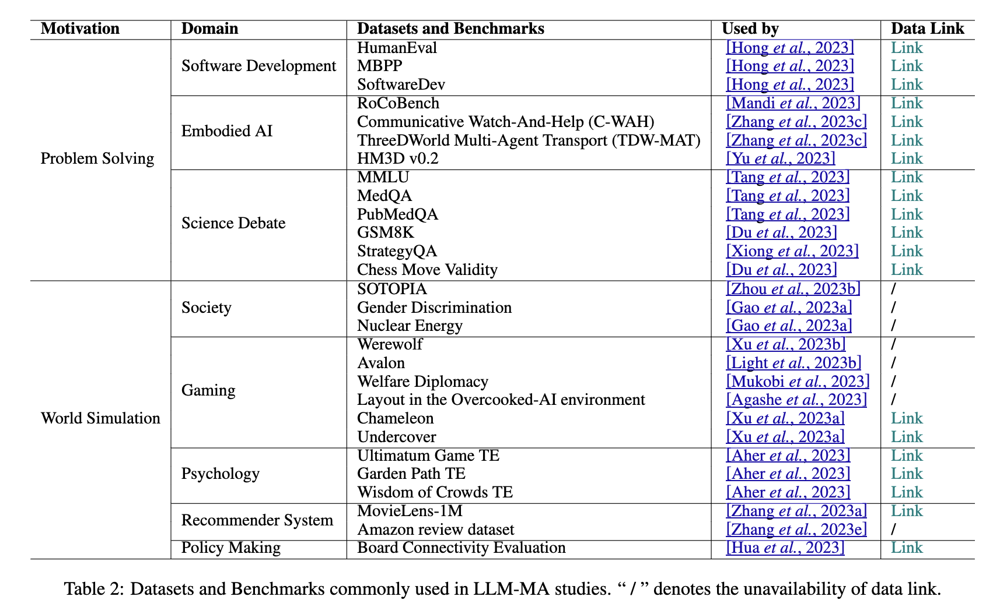

# [MAS Survey](https://arxiv.org/pdf/2402.01680)

> Guo, Taicheng, Xiuying Chen, Yaqi Wang, Ruidi Chang, Shichao Pei, Nitesh V. Chawla, Olaf Wiest, and Xiangliang Zhang. "Large language model based multi-agents: A survey of progress and challenges." *arXiv preprint arXiv:2402.01680* (2024).

    @article{guo2024large,
        title={Large language model based multi-agents: A survey of progress and challenges},
        author={Guo, Taicheng and Chen, Xiuying and Wang, Yaqi and Chang, Ruidi and Pei, Shichao and Chawla, Nitesh V and Wiest, Olaf and Zhang, Xiangliang},
        journal={arXiv preprint arXiv:2402.01680},
        year={2024}
    }

## Benchmarks

## Challenges
- Hallucination has a cascading effect
- Benchmarks should be made specifically for MASs
- Scaling up
- learning environments are hard to design & need to be adapted for multi-agent systems to facilitate collective thinking